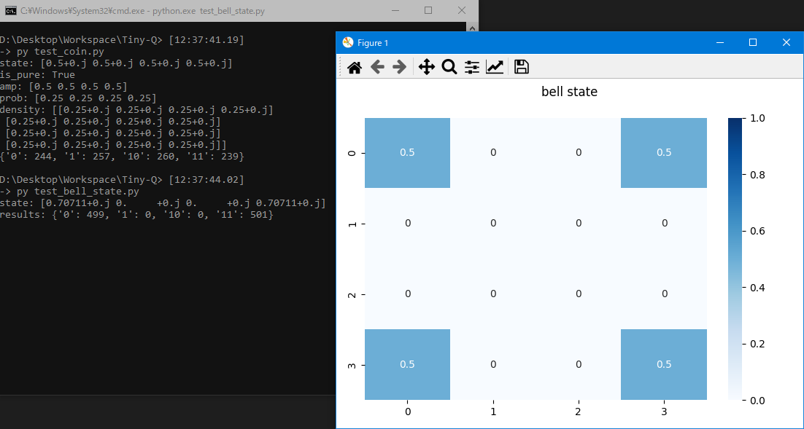

# Tiny-Q

    Tiny-Q is a minimal framework to show quantum computation basics in a tensor/matrix perspective view.

----



=> One-command installation: `pip install .`
=> Start interactive python shell with Tiny-Q environment: `python tiny_q.py`

```python
(InteractiveConsole)
>>> v('00')
array([1.+0.j, 0.+0.j, 0.+0.j, 0.+0.j], dtype=complex64)
>>> H
array([[ 0.7071+0.j,  0.7071+0.j],
       [ 0.7071+0.j, -0.7071+0.j]], dtype=complex64)
>>> CNOT
array([[1.+0.j, 0.+0.j, 0.+0.j, 0.+0.j],
       [0.+0.j, 1.+0.j, 0.+0.j, 0.+0.j],
       [0.+0.j, 0.+0.j, 0.+0.j, 1.+0.j],
       [0.+0.j, 0.+0.j, 1.+0.j, 0.+0.j]], dtype=complex64)
>>> q = CNOT * (H @ I) | v('00')
>>> q.info()
|phi>
  state: [0.7071+0.j 0.    +0.j 0.    +0.j 0.7071+0.j]
  amp: [0.7071 0.     0.     0.7071]
  prob: [0.5 0.  0.  0.5]
  density: [[0.5+0.j 0. +0.j 0. +0.j 0.5+0.j]
 [0. +0.j 0. +0.j 0. +0.j 0. +0.j]
 [0. +0.j 0. +0.j 0. +0.j 0. +0.j]
 [0.5+0.j 0. +0.j 0. +0.j 0.5+0.j]]
  trace: (0.99999994+0j)

>>> q > Measure()
{'00': 489, '01': 0, '10': 0, '11': 511}
>>> q < Measure
>>> q.info()
|phi>
  state: [1.+0.j 0.+0.j 0.+0.j 0.+0.j]
  amp: [1. 0. 0. 0.]
  prob: [1. 0. 0. 0.]
  density: [[1.+0.j 0.+0.j 0.+0.j 0.+0.j]
 [0.+0.j 0.+0.j 0.+0.j 0.+0.j]
 [0.+0.j 0.+0.j 0.+0.j 0.+0.j]
 [0.+0.j 0.+0.j 0.+0.j 0.+0.j]]
  trace: (1+0j)

>>>
now exiting InteractiveConsole...
```


The main difference from existing framesworks is that, we distinguish types of operations 
-- `gate composition (*/<<)`, `gate application (|)`, `system expansion (@)`, `quantum measure (>,<)` 
-- by different python operators to make formula syntax more clear :)

```python
# use mul * or lshift << for gate composition, mind the gate apply order
# u = Gate * Gate (more like math formula, reducing from **right**)
u = X * H
u = gate3 * gate2 * gate1
# u = Gate << Gate (more like programs, running from **left**, modify **inplace**)
u = H << X
u = gate1 << gate2 << gate3

# use pipe | for gate application
# q = Gate | State
q = X | v0

# use matmul @ for system expansion (gate/state tensor product)
#u = Gate @ Gate
u = H @ I
#q = State @ State
q = v0 @ v1
# NOTE: the low qubit starts from **right**
q = v_high @ v_mid @ v_low    # => |high,mid,low>

# use > for virtual measurements
# r = State > Measure, single measure
r = H | v0 > Measure
# r = State > Measure(count), bunch measure
r = CNOT * (H @ I) | State.zero(2) > Measure(1000)
# p = State > State, project by state
p = v0 > h0
# p = State > MeasureOp, project by measure operator
p = h0 > M0

# use < for real measure with state collapse
# State < Measure
q = CNOT * (H @ I) | v('00')
q < Measure
```

⚪ API stubs

```python
class Meta:
  .n_qubits -> int              # qubit count of current system
  .dagger -> Meta               # dagger of State/Gate/MeasureOp

class State(Meta):
  .zero() -> State              # alloc a |0> string
  .one() -> State               # alloc a |1> string
  .__eq__() -> bool             # state equality (ignoring global phase)
  .__matmul__() -> State        # v0 @ v1: state expansion
  .__lt__() -> Union            # v0 < Measure, real measure with state collapse
  .__gt__() -> Union            # v0 > Measure|Measure()|State|MeasureOp, virtual measurements
  .is_pure -> bool              # purity
  .amp -> np.ndarray            # amplitude
  .prob -> np.ndarray           # probabilty distribution
  .density -> np.ndarray        # density matrix
  .trace -> float               # trace of density matrix
  .info()                       # quick show info
  .plot_prob()                  # plot probabilty distribution
  .plot_density()               # plot density matrix
  .plots()                      # plot all figures

class Gate(Meta):
  .__eq__() -> bool             # gate equality
  .__neg__() -> Gate            # -H, global negative
  .__xor__() -> Gate            # H^alpha, gate self-power
  .__mul__() -> Gate            # X * H: gate composition
  .__lshift__() -> Gate         # H << X: gate composition (reverse order of __mul__)
  .__matmul__() -> Gate         # X @ H: gate expansion
  .__or__() -> State            # X | v0: gate application
  .is_unitary -> bool           # unitary (should always be True)
  .is_hermitian -> bool         # hermitian (True for most gates)
  .info()                       # quick show info

class MeasureOp(Meta):
  .check_completeness() -> bool
```

----

by Armit
2023/03/15 
